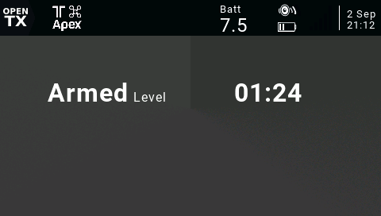

# QuadStat

An OpenTX widget intended for the Jumper T16 and Radiomaster TX16S which displays the current armed state and flight mode of the flight controller based upon configured switch positions.

## Disclaimer

This script does not rely on telemetry. It does not reflect the actual craft's state and should not be used in situations where reliable data is critical. It is the user's responsibility to check for correct operation before use.

**IF IN DOUBT, DO NOT FLY!**

## Options

| Option    | Description              |
| --------- | ------------------------ |
| Armed     | Arming switch            |
| Level     | Level flight mode switch |
| Turtle    | Turtle mode switch       |
| ArmClr    | Text color when armed    |
| DisarmClr | Text color when disarmed |

## Installation

Download the `.zip` file from the [latest release](https://github.com/udyux/opentx-widget-quadstat/releases/latest), extract it and place the folder in the `/WIDGETS/` directory on your transmitter's SD card.

## Usage

For the time being, this widget is intended to be used with the 8-cell layout (2 columns, 4 rows).

Simply select the widget, configure the switches you use for arming, activating level and turtle modes and you're all set.

## Screenshots

 

 

 

 

